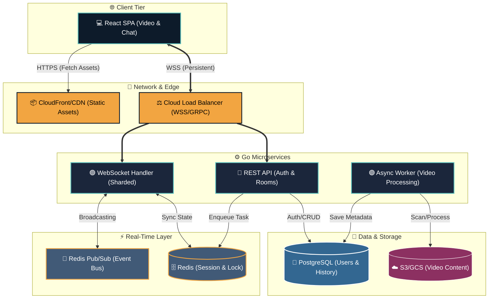

  
  
  
   
  

  
  
  
  

---

### About Me

I am a Master's student in **Computer Science** at the **University of Texas at Dallas** (GPA 4.0), actively seeking New Graduate and Entry-Level Software Engineering roles. I am passionate about building scalable distributed systems, network architectures, and AI-driven applications.

- 💼 **Latest Role:** Software Development Intern at **Paycom** (working on .NET/React & OCR engines).
- 🏢 **Previous Experience:** Senior Associate of Development at **American Express**, where I designed, developed and scaled internal tools using Python, Golang and GCP.
- 🏆 **Achievements:** Paycom Code-a-thon Winner (2025) & Gupta Fellow at UT Dallas.
- ⚡ **Interests:** High-concurrency systems, Cloud Architecture (AWS/GCP), and Generative AI (RAG pipelines).

---

### GitHub Achievements

  

---

### Tech Stack & Tools

| **Category**          | **Technologies**                                                                                                                  |
| :-------------------- | :-------------------------------------------------------------------------------------------------------------------------------- |
| **Languages**         |                                     |
| **Backend & Cloud**   |  |
| **Databases & Cache** |                                        |
| **Frontend & Tools**  |                                     |

---

### Featured Projects

| Project                               | Tech Stack                               | Description                                                                                                                 |
| :------------------------------------ | :--------------------------------------- | :-------------------------------------------------------------------------------------------------------------------------- |
| **Distributed Real-Time Watch Party** | `Golang` `Redis` `WebSockets` `React`    | Architected a **distributed system** handling 10k+ concurrent users via **sharding** and **event-driven** message delivery. |
| **Network Path Visualizer**           | `Python` `React` `Graph Algorithms`      | Built a highly interactive tool for visualizing complex network routing, pathing, and architectural topologies.             |
| **AI Financial Analyst (SIA)**        | `LangChain` `FAISS` `Gemini`             | Built a financial advisor using a Retrieval-Augmented Generation (RAG) system for sub-second vector search retrieval.       |
| **Cloud-Native AI Video Generator**   | `Kubernetes` `FastAPI` `Celery` `FFmpeg` | Designed a containerized video pipeline, auto-scaling worker nodes to reduce processing time by 90%.                        |

#### 🏗️ WatchParty Architecture

---

### Daily Analytics

---

### Contributions

<picture>
<source media="(prefers-color-scheme: dark)" srcset="https://raw.githubusercontent.com/uddeshsingh/uddeshsingh/output/github-contribution-snake-dark.svg">
<source media="(prefers-color-scheme: light)" srcset="https://raw.githubusercontent.com/uddeshsingh/uddeshsingh/output/github-contribution-snake.svg">

</picture>

